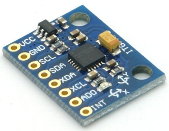

# Jetson上MPU6050接入ROS2

# 一、Jetson Orin Nano Super (8GB) + MPU6050 集成 ROS2 实现 IMU 数据发布

>  [!tip]
>
>  ### 为什么需要 **MPU6050**
>
>  # 因为我使用的是 **D435（非 D435i）**，它本身不带 IMU。
>
>  在 SLAM 中，IMU 数据（加速度 + 角速度）可以帮助：
>
>  1. **提高位姿估计的稳定性** —— 在相机运动模糊、特征缺失时提供短时运动约束。
>  2. **实现视觉-惯性融合建图** —— RTAB-Map 或 VIO 算法（如 VINS-Fusion、FAST-LIO2）可以融合 IMU 提升精度。
>  3. **启动阶段更快收敛** —— IMU 可辅助初始化方向与加速度估计。
>
>  所以我用 **MPU6050（通过 I²C 接 Jetson）** 来弥补 D435 缺少 IMU 的功能，这是一个非常合理的系统设计。

## 3.1 Jetson Orin Nano Super (8GB) 引脚图介绍

```bash
sudo /opt/nvidia/jetson-io/jetson-io.py
```

```bash
 =================== Jetson Expansion Header Tool ===================
 |                                                                    |
 |                                                                    |
 |                      3.3V (  1) .. (  2) 5V                        |
 |                      i2c8 (  3) .. (  4) 5V                        |
 |                      i2c8 (  5) .. (  6) GND                       |
 |                    unused (  7) .. (  8) uarta                     |
 |                       GND (  9) .. ( 10) uarta                     |
 |                    unused ( 11) .. ( 12) unused                    |
 |                    unused ( 13) .. ( 14) GND                       |
 |                    unused ( 15) .. ( 16) unused                    |
 |                      3.3V ( 17) .. ( 18) unused                    |
 |                    unused ( 19) .. ( 20) GND                       |
 |                    unused ( 21) .. ( 22) unused                    |
 |                    unused ( 23) .. ( 24) unused                    |
 |                       GND ( 25) .. ( 26) unused                    |
 |                      i2c2 ( 27) .. ( 28) i2c2                      |
 |                    unused ( 29) .. ( 30) GND                       |
 |                    unused ( 31) .. ( 32) unused                    |
 |                    unused ( 33) .. ( 34) GND                       |
 |                    unused ( 35) .. ( 36) unused                    |
 |                    unused ( 37) .. ( 38) unused                    |
 |                       GND ( 39) .. ( 40) unused                    |
 |                                                                    |
 |                                                                    |
 |                        Jetson 40pin Header:                        |
 |                                                                    |
 |                 Configure for compatible hardware                  |
 |                   Configure header pins manually                   |
 |                                Back                                |
 |                                                                    |
 |====================================================================|

```


## 3.2 MPU6050的特点和功能

> [!note]
>
> ## 1.1 六轴传感器
>
> MPU6050集成了三轴加速度传感器和三轴陀螺仪，六轴传感器的主要优势在于结合了加速度计和陀螺仪的测量结果，可以提供更全面和准确的物体运动和姿态信息。通过综合加速度计和陀螺仪的数据，六轴传感器可以估计物体的姿态（如欧拉角或四元数），以及物体在三个空间方向上的加速度和角速度。
>
> ## 1.2 数字运动处理器
>
> MPU6050内置的数字运动处理器可以进行复杂的运动处理和数据处理，包括传感器数据的滤波、噪声消除、运动融合算法等。它通过处理器内部的算法，提供了方便快捷的姿态解算。
>
> ## 1.3 I2C通信接口
>
> MPU6050传感器通信协议可以选择使用I2C或SPI。 I2C是最常用的通信协议，适用于大多数情况下。SPI是一种高速串行通信协议，更加适用于性能要求较高的应用场景。
>
> 支持的I2C通信模式中，包括两个信号线SCL（串行时钟线）和SDA（串行数据线）。通过I2C通信，可以与MPU6050进行数据的读取和写入，另一篇博客有讲到。[I2C（IIC）通信协议详解与应用](https://blog.csdn.net/Goforyouqp/article/details/131515367?spm=1001.2014.3001.5502)
>
> 如果选择使用SPI通信协议，可以参考MPU6050的数据手册以及您所使用的STM32的文档，配置和连接SPI总线，设置通信参数，并使用SPI协议与MPU6050进行数据交换，我是很少使用SPI通信的，详细的通信协议另一篇博客也有讲到，想了解的也可以去看一下。[了解SPI通信：串行外设接口的基本工作原理，51、stm32实现SPI](https://blog.csdn.net/Goforyouqp/article/details/131511080?spm=1001.2014.3001.5502)
>
> ## 1.4 高精度和低功耗
>
> 为了实现MPU6050的高精度，我们可以进行传感器校准、数据滤波、温度补偿、数据处理和算法优化，以及系统调优等步骤。通过这些措施，可以提高MPU6050的测量精度和稳定性，确保获得准确可靠的运动测量和姿态估计结果，同时通过智能功耗控制来延长电池寿命。
>
> ## 1.5 集成ROS2
>
> 参考网站：
>
> -  https://github.com/hiwad-aziz/ros2_mpu6050_driver，
> -  https://github.com/kimsniper/ros2_mpu6050?tab=readme-ov-file

|                            实物图                            |                            引脚图                            |
| :----------------------------------------------------------: | :----------------------------------------------------------: |
|  |  |
|                **GY-521模块上各个引脚的作用**                |                            连接图                            |
|  |  |

## 3.3 Jetson 与MPU6050接线图

```bash
VCC ---接Nano引脚第17脚
GND ---接Nano 引脚第25脚
SCL ---接Nano 引脚第5脚(GEN2_I2C_SCL)
SDA ---接Nano 引脚第3脚(GEN2_I2C_SDA)
```

|                          仿真接线图                          | 实物接线图                                                   |
| :----------------------------------------------------------: | ------------------------------------------------------------ |
|  |  |

引脚 3 和 5 位于 I2C 总线 7 上

```bash
sudo i2cdetect -y -r 7
```


# 二、创建MPU6050 ROS2工作空间

## 2.1 创建目录

```bash
sudo mkdir ljh_mpu6050_ws/
sudo mkdir src
```

## 2.2 下载源码

```bash
sudo apt update
sudo apt install libi2c-dev
cd src
git clone https://github.com/hiwad-aziz/ros2_mpu6050_driver.git
```

## 2.3 编译

```bash
colcon build --packages-select mpu6050driver
```


## 2.4 启动结点

```bash
ros2 launch mpu6050driver mpu6050driver_launch.py
```


## 2.5 验证 IMU 数据

```bash
ros2 topic list
# 确认有 /imu 话题

ros2 topic echo /imu
# 查看实时发布的加速度和角速度数据
```


## 2.6 在rqt_plot中画加速度或角速度曲线

```bash
ros2 run rqt_plot rqt_plot
```

在界面里添加话题

```bash
/imu/linear_acceleration/x
/imu/linear_acceleration/y
/imu/linear_acceleration/z
```


## 2.7 在Rviz2中验证

> 波动mpu6050可以实现Rviz2中同步变化


